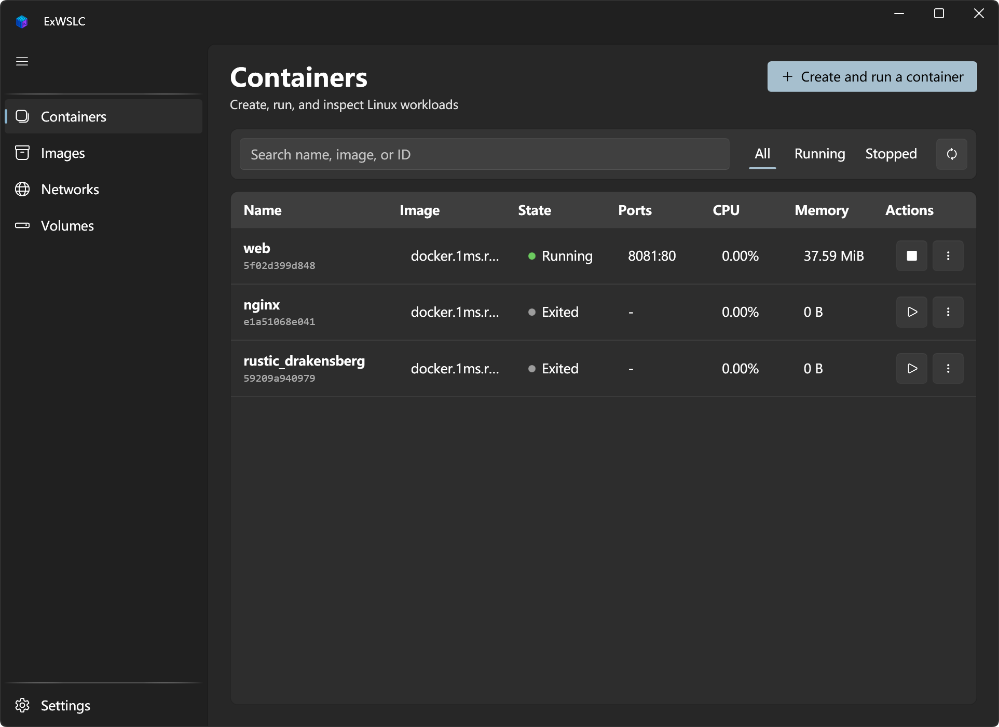

<h1>
  
  ExWSLC
</h1>

English | [中文](README_zh.md)

ExWSLC is a native Windows desktop manager for [WSL Container](https://learn.microsoft.com/windows/wsl/wsl-container), the container runtime built into current WSL releases. It manages Linux containers, images, networks, volumes, registries, logs, exec sessions, and resource statistics without requiring Docker Desktop.

> WSL Container and its SDK are currently in preview. ExWSLC checks the installed CLI and SDK at startup and isolates preview-specific behavior behind a runtime interface.

## Download

Download the latest self-contained package from [GitHub Releases](https://github.com/A-Words/ExWSLC/releases/latest):

- `win-x64` for most Intel and AMD Windows PCs.
- `win-arm64` for Windows on Arm devices.

Extract the archive and run `ExWSLC.exe`. A separate .NET installation is not required for release packages.

## Screenshot



## Features

- WPF-UI 4.3 Fluent desktop UI with Mica, system/light/dark themes, English and Simplified Chinese.
- Dedicated workspaces for containers, images, networks, volumes, and settings.
- Split container workbench with a searchable list, creation form, quick lifecycle actions, and a detailed selected-container view.
- Container creation with CPU, memory, GPU, ports, environment, network, user, workdir, and volume options.
- Container details for logs, resource usage, networking, mounts, configuration, and raw inspect output.
- Start, graceful stop, force stop, restart, remove, export, live log following, one-shot exec, and Windows Terminal access.
- Pull, build, import, load, save, tag, push, inspect, remove, and prune images.
- Create, inspect, remove, and prune networks; create, remove, and prune named volumes.
- Cancellable runtime operations, registry login through `--password-stdin`, and native WSLC settings access.
- Persistent application preferences for refresh interval, language, and theme.

The navigation hierarchy and Fluent master-detail composition are inspired by
[ExHyperV](https://github.com/Justsenger/ExHyperV). ExWSLC's views, resources,
and product assets are implemented from scratch for the WSL Container workflow.

## Requirements

- Windows 11 with WSL installed and updated to a release that includes `wslc.exe` (tested with WSL 2.9.3).
- [.NET 10 SDK](https://dotnet.microsoft.com/download/dotnet/10.0) to build from source. Release packages are self-contained.
- Windows Terminal is optional and only required for interactive container terminals.

Run `wsl --update` and `wslc version` if the application reports missing components.

## Build and run

```powershell
dotnet restore ExWSLC.sln
dotnet build ExWSLC.sln
dotnet test ExWSLC.sln
dotnet run --project src/ExWSLC.csproj
```

Publish a self-contained package (replace `<RID>` with `win-x64` or `win-arm64`):

```powershell
dotnet publish src/ExWSLC.csproj -c Release -r <RID> --self-contained true -o publish/<RID>
```

The project targets `net10.0-windows10.0.19041.0`.

## Settings and safety

Application settings are stored at:

```text
%LocalAppData%\ExWSLC\settings.json
```

ExWSLC only persists application preferences such as language, theme, and refresh interval. Runtime inventory always comes from WSLC itself.

Safety boundaries:

- Every `wslc.exe` argument is passed through `ProcessStartInfo.ArgumentList`; user input is never concatenated into a shell command.
- Registry passwords are sent to `wslc registry login --password-stdin` through standard input and are not written to settings, task logs, or command displays.
- Destructive operations such as remove and prune require explicit UI confirmation.
- Long-running tasks can be cancelled and will try to terminate the complete child process tree.

## Architecture

ExWSLC follows a WPF / MVVM structure:

```text
WPF Views → Page ViewModels → RuntimeWorkspace → IContainerRuntime → wslc.exe
                                      ↘ ITaskService
                                      ↘ ISettingsService
Startup → IRuntimeCapabilityService → Microsoft.WSL.Containers.WslcService
```

`wslc.exe --format json` is currently the source of truth for containers, images, networks, volumes, and resource statistics. `Microsoft.WSL.Containers` is used for prerequisite detection, version reporting, and user-initiated dependency installation. Once the preview API stabilizes, a fuller native provider can replace the CLI implementation behind `IContainerRuntime`.

See [docs/architecture.md](docs/architecture.md) for more design notes.

## Testing

Unit tests cover:

- `wslc` argument mapping and command-injection boundaries.
- Preview JSON field compatibility.
- Task cancellation, task state transitions, and ViewModel error recovery.
- Registry password redaction.
- Settings persistence.
- ViewModel refresh, search, and selection preservation.
- Container inspect, network, and mount parsing and loading behavior.
- Localization resources, XAML bindings, and reusable control behavior.

Run tests:

```powershell
dotnet test ExWSLC.sln
```

## Contributing

Issues and improvements are welcome. Please read [CONTRIBUTING.md](CONTRIBUTING.md) before contributing. Because WSL Container is still in preview, runtime behavior changes should include the test environment, `wslc version` output, and reproduction steps where possible.

## License

Copyright © 2026 ExWSLC contributors.

Licensed under the [GNU General Public License v3.0](LICENSE).
