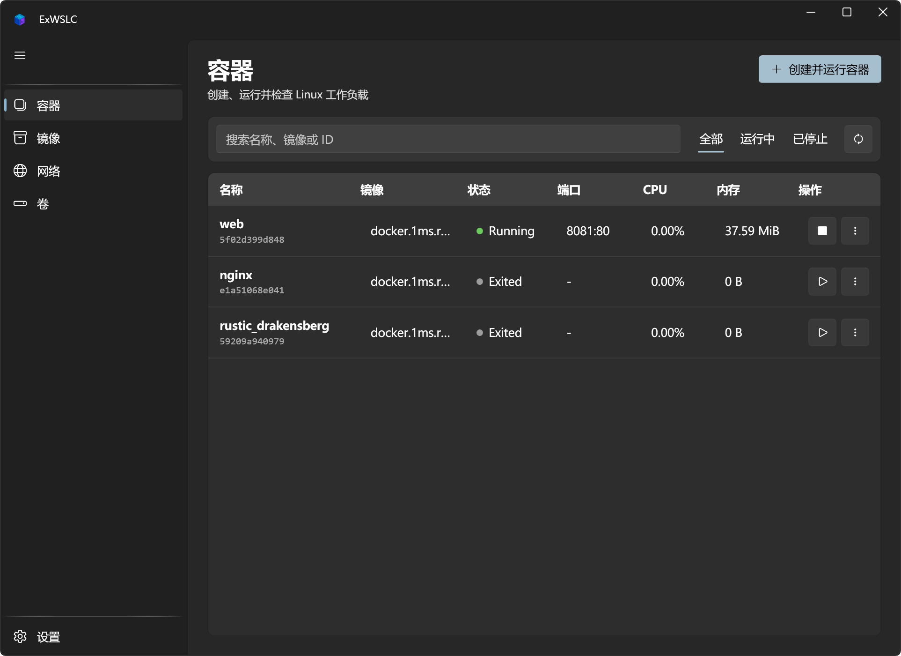

<h1>
  
  ExWSLC
</h1>

[English](README.md) | 中文

ExWSLC 是一个原生 Windows 桌面端的 [WSL Container](https://learn.microsoft.com/windows/wsl/wsl-container) 管理器。它面向当前 WSL 内置的容器运行时，提供容器、镜像、网络、卷、注册表、日志、命令执行和资源统计管理，不依赖 Docker Desktop。

> WSL Container 及其 SDK 目前仍处于预览阶段。ExWSLC 会在启动时检查已安装的 CLI 与 SDK，并把预览期差异隔离在运行时接口后面，方便后续适配正式版 API。

## 下载

前往 [GitHub Releases](https://github.com/A-Words/ExWSLC/releases/latest) 下载最新的自包含发布包：

- 大多数 Intel 和 AMD Windows 电脑请选择 `win-x64`。
- Windows on Arm 设备请选择 `win-arm64`。

解压后运行 `ExWSLC.exe` 即可，发布包不要求另行安装 .NET。

## 运行截图



## 功能特性

- 基于 WPF-UI 4.3 的 Fluent 桌面界面，支持 Mica、系统/浅色/深色主题，以及英文和简体中文。
- 为容器、镜像、网络、卷和设置提供独立工作区。
- 容器双栏工作台：包含可搜索列表、创建表单、快捷生命周期操作和所选容器的详细视图。
- 创建容器时支持 CPU、内存、GPU、端口、环境变量、网络、用户、工作目录和卷挂载等参数。
- 容器详情涵盖日志、资源用量、网络、挂载、配置和原始 Inspect 输出。
- 容器生命周期管理：启动、停止、强制停止、重启、删除、导出、实时跟随日志、一次性 Exec，以及打开 Windows Terminal 交互终端。
- 镜像管理：拉取、构建、导入、加载、保存、打标签、推送、Inspect、删除和清理。
- 网络支持创建、Inspect、删除和清理；命名卷支持创建、删除和清理。
- 支持取消运行时操作、通过 `--password-stdin` 登录注册表，以及打开原生 WSLC 设置。
- 应用设置持久化，支持刷新间隔、语言和主题配置。

界面导航和 Fluent 主从布局参考了 [ExHyperV](https://github.com/Justsenger/ExHyperV) 的产品组织方式；ExWSLC 的视图、资源和产品素材均围绕 WSL Container 工作流重新实现。

## 运行要求

- Windows 11。
- 已安装并更新到包含 `wslc.exe` 的 WSL 版本；项目开发时使用 WSL 2.9.3 进行验证。
- [.NET 10 SDK](https://dotnet.microsoft.com/download/dotnet/10.0)，用于从源码构建；发布包已自包含运行时。
- Windows Terminal 为可选依赖，仅在打开交互式容器终端时需要。

如果应用提示缺少组件，可以先执行：

```powershell
wsl --update
wslc version
```

## 构建与运行

在仓库根目录执行：

```powershell
dotnet restore ExWSLC.sln
dotnet build ExWSLC.sln
dotnet test ExWSLC.sln
dotnet run --project src/ExWSLC.csproj
```

发布自包含包（将 `<RID>` 替换为 `win-x64` 或 `win-arm64`）：

```powershell
dotnet publish src/ExWSLC.csproj -c Release -r <RID> --self-contained true -o publish/<RID>
```

项目目标框架为 `net10.0-windows10.0.19041.0`。

## 设置与安全

应用设置保存在：

```text
%LocalAppData%\ExWSLC\settings.json
```

ExWSLC 只持久化应用偏好设置，例如语言、主题和刷新间隔。运行时清单始终来自 WSLC 本身。

安全边界：

- 所有 `wslc.exe` 参数通过 `ProcessStartInfo.ArgumentList` 传递，不拼接 shell 命令。
- 注册表密码通过标准输入传给 `wslc registry login --password-stdin`，不会写入设置、任务日志或命令显示。
- 删除、清理等破坏性操作会在 UI 中二次确认。
- 长时间运行的任务支持取消，并会尝试终止完整子进程树。

## 架构概览

ExWSLC 采用 WPF / MVVM 结构：

```text
WPF Views → Page ViewModels → RuntimeWorkspace → IContainerRuntime → wslc.exe
                                      ↘ ITaskService
                                      ↘ ISettingsService
Startup → IRuntimeCapabilityService → Microsoft.WSL.Containers.WslcService
```

当前以 `wslc.exe --format json` 作为容器、镜像、网络、卷和统计信息的事实来源。`Microsoft.WSL.Containers` SDK 主要用于依赖检测、版本报告和用户主动安装缺失组件。等预览 API 稳定后，可以通过替换 `IContainerRuntime` 实现切换到更完整的原生 API。

更多设计说明见 [docs/architecture.md](docs/architecture.md)。

## 测试

单元测试覆盖：

- `wslc` 参数映射和命令注入边界。
- 预览 JSON 字段兼容。
- 任务取消、状态流转和错误恢复。
- 注册表密码脱敏。
- 设置持久化。
- ViewModel 刷新、搜索和选中状态保持。
- 容器 Inspect、网络与挂载信息的解析和按需加载。
- 本地化资源、XAML 绑定与可复用控件行为。

运行测试：

```powershell
dotnet test ExWSLC.sln
```

## 贡献

欢迎提交 issue 和改进建议。贡献前请阅读 [CONTRIBUTING.md](CONTRIBUTING.md)。由于 WSL Container 仍处于预览阶段，涉及运行时行为的修改请尽量说明测试环境、`wslc version` 输出和复现步骤。

## 许可证

Copyright © 2026 ExWSLC contributors.

本项目基于 [GNU General Public License v3.0](LICENSE) 授权。
