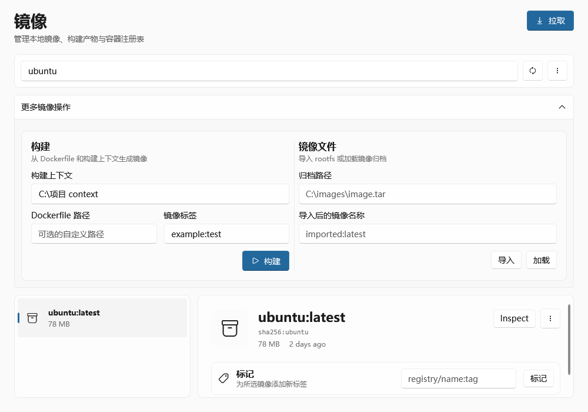
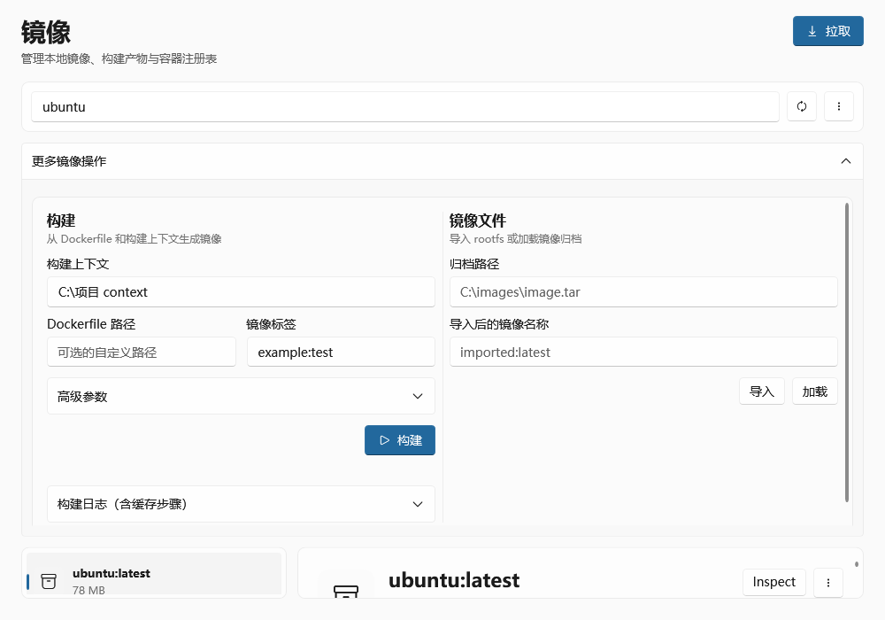
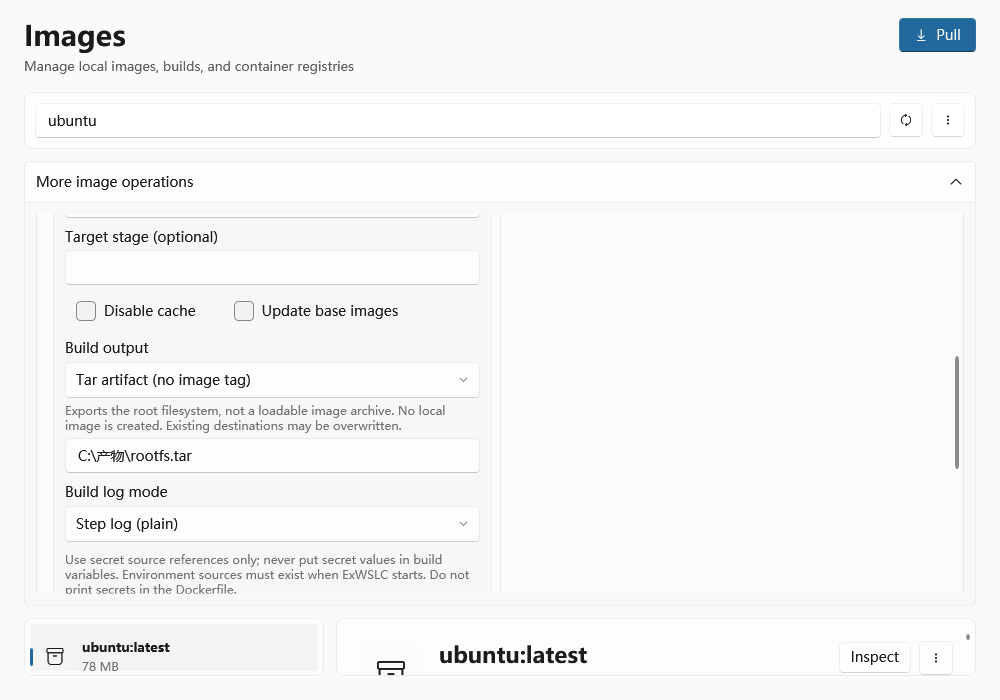
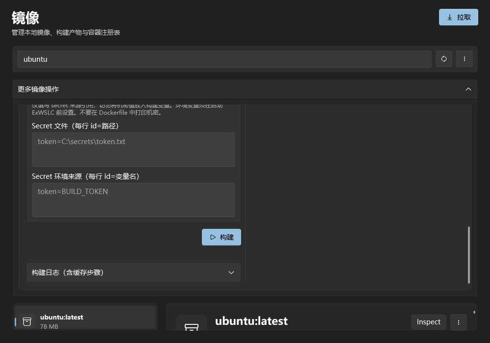

# 任务 06：高级镜像构建验证

日期：2026-09-12。工作树：`C:\Users\A_Words\.codex\worktrees\416b\ExWSLC`；分支：`feat/06-advanced-image-build`；起始基线：`72d0943784f994caf5a0b96c43e45994a821226b`。

初始工作树干净、HEAD detached，已创建任务分支。`git merge-base --is-ancestor f85b111 HEAD` 成功，任务 01、02（d9e321e、f85b111）已包含。没有合并其他分支。

## 环境及能力依据

| 层次 | 本次核实 |
| --- | --- |
| Windows | Windows 11，10.0.26200.9445 |
| WSL / kernel | 2.9.10.0 / 6.18.40.1-1（wsl --version） |
| CLI | 2.9.10.0（wslc version、wslc version --format json） |
| 服务 | 2.9.10（现有 WslcSdkService.GetServiceVersion） |
| SDK | 项目及实际还原包 Microsoft.WSL.Containers 2.9.9 |
| .NET SDK | 10.0.401 |
| 公开发行 | GitHub latest 稳定版 2.7.14；2.9.10 是 prerelease |
| 上游主线 | 查阅时 master 为 eaa69e766cf375d96053207a4ba8858f54ea1536，构建入口含 secret/output/progress |

查阅：[C# API](https://wsl.dev/api-reference/csharp/)、[2.9.9 IDL](https://github.com/microsoft/WSL/blob/2.9.9/src/windows/WslcSDK/winrt/wslcsdk.idl)、[2.9.10 命令](https://github.com/microsoft/WSL/blob/2.9.10/src/windows/wslc/commands/ImageBuildCommand.cpp)、[2.9.10 ImageService](https://github.com/microsoft/WSL/blob/2.9.10/src/windows/wslc/services/ImageService.cpp)、[Buildx local/tar 语义](https://docs.docker.com/build/exporters/local-tar/)、[稳定发行](https://github.com/microsoft/WSL/releases/tag/2.7.14)、[预览发行](https://github.com/microsoft/WSL/releases/tag/2.9.10)，以及任务指定 PR [41133](https://github.com/microsoft/WSL/pull/41133)、[41106](https://github.com/microsoft/WSL/pull/41106)、[41157](https://github.com/microsoft/WSL/pull/41157)、[41307](https://github.com/microsoft/WSL/pull/41307)。SDK 2.9.9 公开 IDL 没有构建 API，继续使用 CLI，未修改 SDK 集成或版本。

`wslc build --help` 确认 build-arg、target、no-cache、pull、secret、output、progress、iidfile 存在。实际执行发现：

- 帮助虽举例 `type=local`，但 CLI 明确报 `directory exporters are not supported`，2.9.10 源码也拒绝目录 exporter。因此只提供本地镜像和 tar 产物。
- CLI 拒绝单独的 `--` 分隔符。已移除，并验证上下文不以 `-` 开头（这类路径可写成 `./-folder`）。所有参数仍通过既有 ProcessStartInfo.ArgumentList 传递。

## 实现及共享接口

- `IContainerRuntime.BuildImageAsync` 改为接收 `ImageBuildRequest`；请求、设计时实现、调用方和 Mock 同步更新。包含变量、目标阶段、缓存／拉取、输出、进度、secret 引用。
- 本地镜像标签必填；tar 不传标签，完成文案明确未创建本地镜像。tar 是根文件系统产物，不是供 image load 使用的镜像归档。
- 复用 Workspace 缓存快照及 RuntimeFeature.BuildSecret/BuildOutput/BuildProgress/BuildPull。Unsupported 阻止对应操作，Unknown 允许实际命令报告结果；重检同步更新绑定，并允许清除旧选项或切回本地镜像。不新增检测缓存。
- 高级表单默认折叠，滚动区限高。所有构建字段与 ArchivePath/ImportImageName 独立，不加入设置持久化。
- 默认 plain，提供 auto/plain/quiet；不提供终端 tty。明确不支持 progress 时省略参数。日志保留真实步骤、CACHED，去除 ANSI 样式，不估算百分比。
- 取消复用 Workspace，runtime 将退出码 -2 转为取消异常，使 TaskService 记录 Cancelled；失败显示输出，成功刷新库存。
- secret 仅接受每行 `id=文件路径` 或 `id=环境变量名`，不转换为 build-arg。环境来源使用应用启动时继承的变量，应用不修改全局环境，也不注入其他变量。读取来源仅用于内存过滤完整值及非空行，过滤后才交给任务／页面；展示命令固定为 wslc image build，来源读取失败不回显内容。
- 未采用可选 iidfile：构建后用库存刷新，不额外解析 ID；应用不创建 iidfile 或 secret 临时文件。用户指定的 tar 在失败／取消后可能不完整，不自动删除用户输出。

## 验证与复现

最终 build：0 错误、0 警告；全量测试：238 项，236 通过，2 个 opt-in 默认跳过；两个 opt-in 另行启用并通过。git diff --check 通过，提交前再检查暂存区。

回归覆盖：默认请求、完整高级参数组合、标签边界、输出路径、变量／secret 格式、重复 ID、三种进度模式、中文／空格路径、文件／环境值过滤、来源缺失不启动 CLI、取消任务状态与流式日志、失败输出、成功刷新、能力变化和导入字段隔离。

```powershell
dotnet build ExWSLC.sln
dotnet test ExWSLC.sln
$env:EXWSLC_LIVE_06 = '1'
dotnet test ExWSLC.sln --filter-class ExWSLC.Tests.ImageBuildLiveTests --report-xunit --report-xunit-filename wslc-06-live.xml --results-directory docs/validation/results
Remove-Item Env:EXWSLC_LIVE_06
git diff --check
git diff --cached --check
```

实机入口使用 FROM scratch、多阶段名称 export、ARG FILE 和 COPY proof.txt 的最小上下文，不下载基础镜像。每次生成 exwslc-06-<GUID>:test 标签及同名前缀临时目录。最终记录中的 ID：exwslc-06-7798a68370d64c17b783427a9c9c5293。

实际命令（占位符指本次隔离资源，运行时使用参数列表）：

```text
wslc build --output type=local,dest=<root>/directory <context>
wslc image build --tag <tag> --progress plain <context>
wslc image build --tag <tag> --progress plain <context>
wslc image build --build-arg FILE=proof.txt --target export --no-cache --pull --output type=tar,dest=<root>/中文 output.tar --progress plain --secret id=file,type=file,src=<synthetic-file> --secret id=token,type=env,env=<isolated-variable> <context>
wslc image build --tag <tag> --progress plain <context>
wslc image build --tag <tag> --progress plain <context>
wslc image remove <tag>
```

依次验证目录输出拒绝、本地镜像库存、CACHED、tar 内含 proof.txt、INVALID_INSTRUCTION 失败日志，以及恢复有效上下文后收到首条 CLI 输出即取消。finally 删除独立标签、合成环境变量及测试目录，并断言库存无该标签、目录不存在。未修改用户资源或原生设置，未升级 WSL，未使用全局 prune/shutdown，未清理共享 BuildKit 缓存。原始记录：[wslc-06-live.xml](results/wslc-06-live.xml)，仅含任务测试资源及合成来源引用。

## UI 渲染及剩余边界

隔离 STA 测试加载实际样式和编译后的 ImagesPage，验证中英文及 system/light/dark 六种组合、高级选项初始折叠、tar 标签禁用及恢复。1000×700 内容区近似默认 1100×800 窗口；检查高级区顶部、输出及 secret 区。

```powershell
$env:EXWSLC_UI_06_BASELINE = Join-Path $env:TEMP ('exwslc-06-before-' + [guid]::NewGuid().ToString('N') + '.xaml')
git show 72d0943:src/Views/Pages/ImagesPage.xaml | Set-Content -LiteralPath $env:EXWSLC_UI_06_BASELINE -Encoding utf8
$env:EXWSLC_UI_06_OUTPUT = Join-Path (Get-Location) 'docs/validation/images/wslc-06'
try {
    dotnet test ExWSLC.sln --filter-class ExWSLC.Tests.ImageBuildUiTests
} finally {
    Remove-Item -LiteralPath $env:EXWSLC_UI_06_BASELINE
    Remove-Item Env:EXWSLC_UI_06_BASELINE, Env:EXWSLC_UI_06_OUTPUT
}
```

UI 测试必须单独运行，避免 WPF Application 单例冲突。基线图由原始 XAML 移除事件处理器后离屏加载，当前图来自编译页面，使用设计数据。30 张 PNG 在 [images/wslc-06](images/wslc-06)，命名为 language-theme-before/simple/advanced/output/secrets.png。

| 中文浅色改前离屏渲染 | 中文浅色改后离屏渲染 |
| --- | --- |
|  |  |

| 英文浅色输出区 | 中文深色 secret 区 |
| --- | --- |
|  |  |

**这些是离屏预览，不是桌面截图或完整运行验收。** 当前会话没有 computer-use 技能要求的 node_repl/@oai/sky 入口，已有 CUA 也禁用原生应用控制。真实窗口前后截图、实际点击／键盘、系统主题实时变化、不同 DPI/缩放仍待人工验收。

其他边界：实机验证了 secret 来源传入 CLI，scratch 上下文未执行 RUN --mount=type=secret 消费；过滤测试覆盖已知明文，不能保证识别恶意 Dockerfile 编码／变换后的泄露。pull 已实际传入，但 scratch 不验证远端基础镜像更新。未提供目录 exporter、额外 exporter 或完整 builder 管理。
